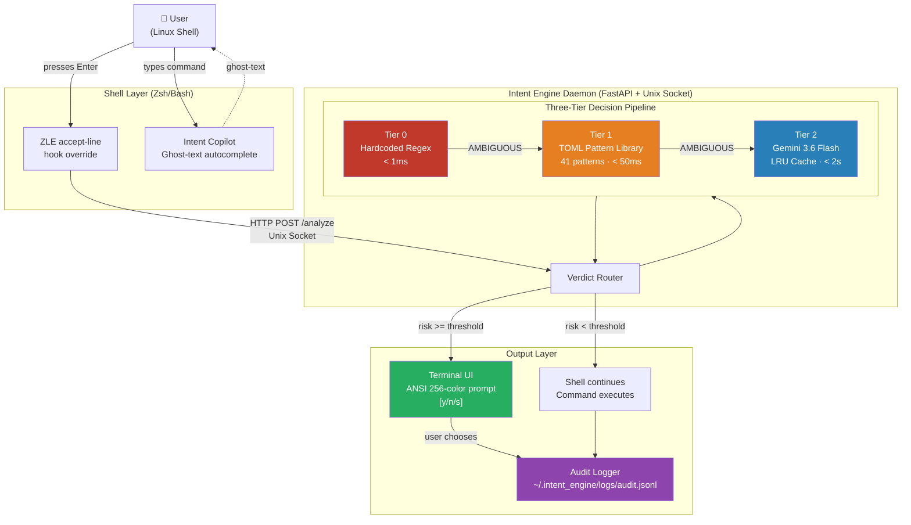
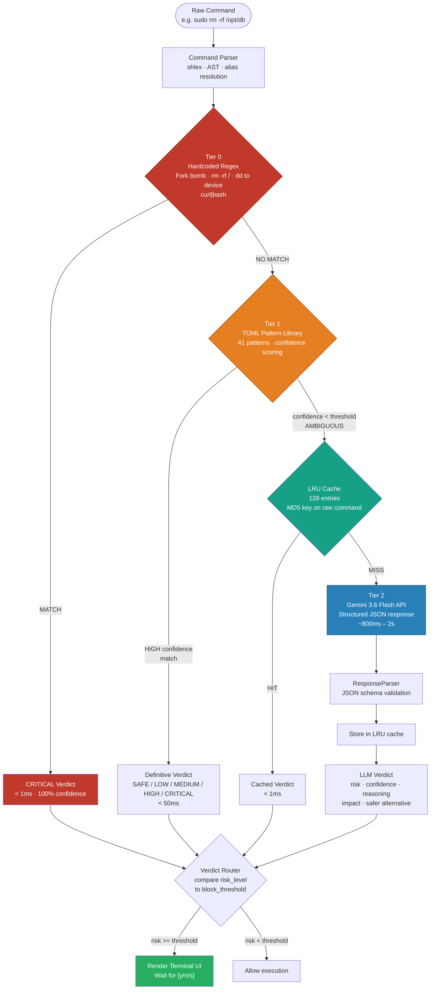
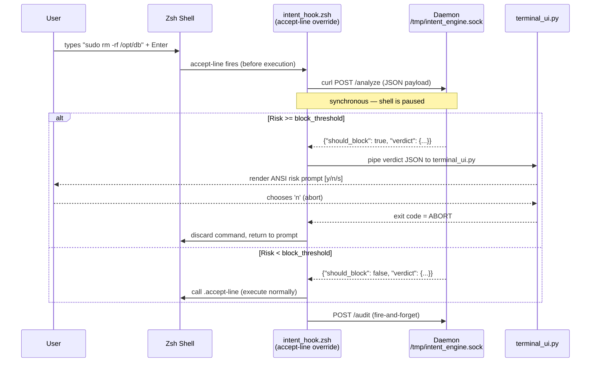
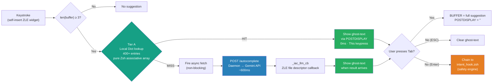
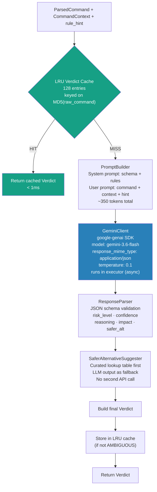
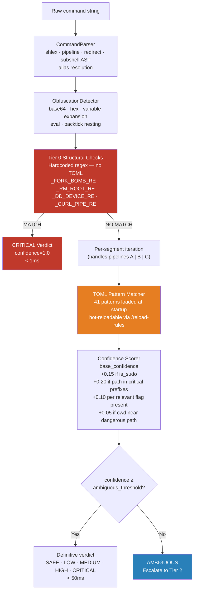
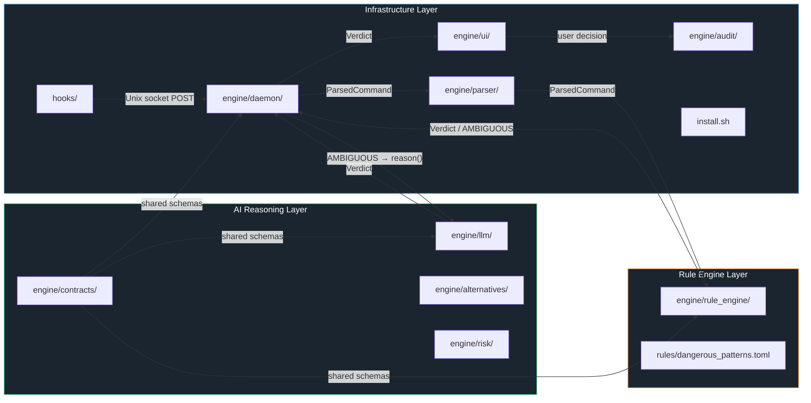
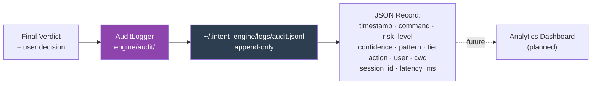
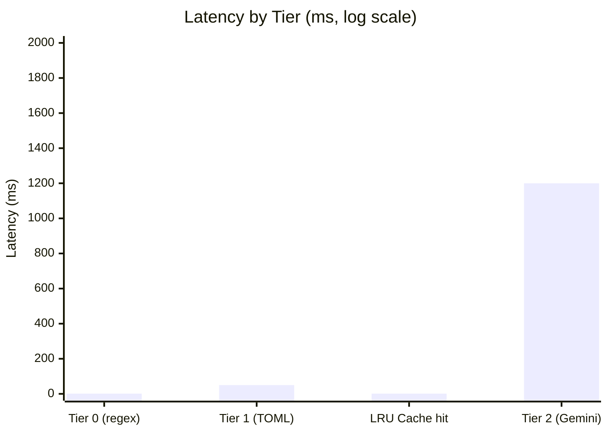

# AI System Intent Engine — Architecture

## 1. System Overview

---

## 2. Three-Tier Decision Pipeline

---

## 3. Shell Hook Integration

---

## 4. Autocomplete (CLI Copilot) Flow

---

## 5. LLM Reasoning Component

---

## 6. Rule Engine Component (Tier 0 + Tier 1)

---

## 7. Data Flow & Component Layers

---

## 8. Audit Log Pipeline

---

## 9. Performance Summary

