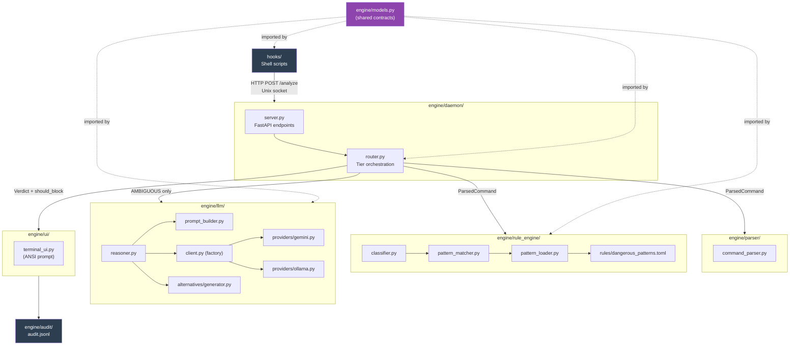
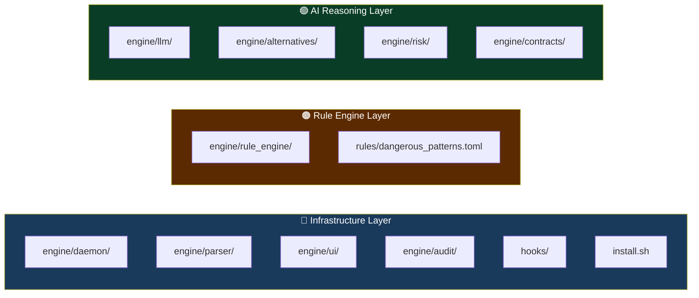

# Project Structure Guide
## AI-Based System Intent Engine — How to Navigate and Contribute

> This document explains every directory in the repo, what it's for, where to add new files, and how the pieces connect. Read this before writing any code.

---

## Top-Level Map

```
AI-Based-System-Intent-Engine/
│
├── engine/                  ← The Python package (ALL runnable code lives here)
│   ├── models.py            ← Shared API contract — the spine of the project
│   ├── config.py            ← Config loader
│   ├── daemon/              ← Harshit: HTTP server + routing brain
│   ├── parser/              ← Harshit: command tokenization
│   ├── rule_engine/         ← Praveen: Tier 0/1 pattern classifier
│   ├── llm/                 ← Vansh: LLM reasoning + safer alternatives
│   └── ui/                  ← Harshit: ANSI terminal confirmation prompt
│
├── hooks/                   ← Shell scripts (zsh + bash integration)
├── rules/                   ← TOML pattern library (Praveen owns this)
├── config/                  ← Default configuration template
├── tests/                   ← All tests
│   ├── unit/                ← Fast, isolated tests per module
│   ├── integration/         ← End-to-end tests (daemon must be running)
│   └── fixtures/            ← Command corpora for batch testing
├── scripts/                 ← Install/uninstall shell scripts
├── docs/                    ← This file, work division, architecture
├── .github/workflows/       ← CI pipeline (runs on every push)
├── pyproject.toml           ← Project metadata + dependencies
├── requirements.txt         ← Runtime dependencies (pinned)
└── requirements-dev.txt     ← Dev tools (pytest, ruff, mypy)
```

---

## Module Dependency Graph



## Component Layers



---

## Directory Deep-Dive

---

### `engine/` — The Core Package

Everything the daemon, shell hook, and tests import comes from here. It is installed as an editable package (`pip install -e .`), so you can `import engine.models` from anywhere after install.

#### `engine/models.py` — **THE MOST IMPORTANT FILE**

```
Purpose: Defines all Pydantic data models — the shared contract between
         the shell hook, daemon, rule engine, and LLM layer.
         This is a cross-cutting concern — changes require coordination.
```

**When to read it:** Before writing any code in any module.
**When to modify it:** Only when a new field is needed that all three layers must agree on. Run it by the team first.

**Key models:**

| Model | Used By | What It Is |
|---|---|---|
| `CommandContext` | Shell hook → Daemon | Everything about the command and its environment |
| `AnalyzeRequest` | Shell hook → Daemon | Wraps `CommandContext` + `dry_run` flag |
| `Verdict` | Rule engine + LLM → Daemon | The safety assessment output |
| `AnalyzeResponse` | Daemon → Shell hook | Wraps `Verdict` + `should_block` |
| `RiskLevel` | Everywhere | `SAFE / LOW / MEDIUM / HIGH / CRITICAL / AMBIGUOUS` |
| `AuditLogEntry` | Daemon logger | Structured log entry per analyzed command |

---

#### `engine/daemon/` — Background Service

```
Purpose: The always-running background process. Receives commands from
         the shell hook via Unix socket. Routes them through tier pipeline.
         Returns should_block decision.

Files:
  server.py   — FastAPI app, Uvicorn runner, /analyze endpoint, /health, /stats
  router.py   — Tier routing: Rule Engine → [if AMBIGUOUS] → LLM → Response
  session.py  — Per-session allowlist, stats tracking (create this file)
```

**Adding a new endpoint:** Add it to `server.py`. Follow the existing pattern for `/analyze` and `/health`.

**Adding new routing logic:** Add it to `router.py`. Never put business logic in `server.py` — `server.py` just receives requests and calls the router.

**Session state:** Anything that should persist within a single terminal session (but reset when the shell closes) goes in `session.py`. Example: the user's `ALWAYS_ALLOW` decisions.

---

#### `engine/parser/` — Command Tokenizer

```
Purpose: Converts a raw command string into a ParsedCommand object.
         This is what the rule engine and LLM receive — they never
         see the raw string directly.

Files:
  command_parser.py — Main parser (shlex + structural analysis)
  alias_resolver.py — Shell alias expansion (create this)
```

**When to add files here:** If you need to pre-process the command in any way before the rule engine sees it (e.g., variable expansion, heredoc stripping), add it here as a separate module and call it from `command_parser.py`.

**Never add pattern matching here.** The parser's job is purely structural — tokenize, split, detect flags/args. Risk analysis belongs in `rule_engine/`.

---

#### `engine/rule_engine/` — Pattern Classifier

```
Purpose: Tier 0 + Tier 1 rule-based classification. Fast path.
         Returns Verdict. Never calls the LLM.

Files:
  classifier.py      — Main entry point. Orchestrates pattern loading + matching.
  pattern_matcher.py — Praveen implements check_tier0() and match() here.
  pattern_loader.py  — Loads and validates dangerous_patterns.toml.
  service.py         — Standalone FastAPI service for the rule engine (Praveen creates).
```

**Adding a new pattern:** Add a `[[patterns]]` block to `rules/dangerous_patterns.toml`. The Python code auto-loads it — no Python changes needed for new patterns.

**Adding a new category of detection logic:** Add it to `pattern_matcher.py` as a new method. Call it from `match()`.

**Creating `service.py`:** This is a standalone FastAPI app separate from the main daemon. It exposes `/classify` for independent testing. Use the same `AnalyzeRequest` / `Verdict` models.

---

#### `engine/llm/` — AI Reasoning Tier

```
Purpose: Tier 2 LLM reasoning. Only called for AMBIGUOUS commands.
         Produces a definitive (non-AMBIGUOUS) Verdict.

Files:
  client.py           — Abstract base + factory (creates the right provider)
  providers/
    ollama.py         — Local Ollama HTTP client (pre-written)
    gemini.py         — Google Gemini API client (pre-written)
    openai.py         — OpenAI API client (Vansh creates)
  prompt_builder.py   — Assembles the LLM prompt from ParsedCommand + context
  reasoner.py         — Core pipeline: prompt → LLM → parse → suggest → Verdict
  response_parser.py  — Parses and validates the LLM's JSON response
  suggester.py        — Safer alternative suggestion (table lookup + LLM)
```

**Adding a new LLM provider:**
1. Create `engine/llm/providers/yourprovider.py`
2. Implement `BaseLLMClient` (subclass from `client.py`)
3. Register it in `LLMClientFactory._PROVIDERS` in `client.py`
4. Add config option in `config/default_config.toml`

**Tuning the prompt:** Edit `prompt_builder.py`. The system prompt controls how the LLM thinks about risk. The analysis prompt controls what context it sees.

**Never put LLM calls in `classifier.py` or `server.py`.** The LLM is exclusively accessed through `reasoner.py`.

---

#### `engine/ui/` — Confirmation Prompt

```
Purpose: The terminal prompt shown to the user when a command is blocked.
         Reads AnalyzeResponse JSON from stdin, displays it, returns user choice.

Files:
  terminal_ui.py — ANSI color-coded prompt. Runs as __main__ (called by shell hook).
```

**How it's called from the shell hook:**
```bash
echo "$response_json" | python3 -m engine.ui.terminal_ui
# Prints to stdout: EXECUTE | ABORT | EDIT | USE_SAFER
```

**Adding a new user option:** Add it to the prompt in `render_prompt()` and add a new `elif` branch in the input handler. Add the new value to `UserAction` enum in `models.py`.

---

### `hooks/` — Shell Scripts

```
Owner:   Harshit
Purpose: The interception layer. These are .zsh and .bash scripts sourced
         into the user's shell. They intercept commands BEFORE execution.

Files:
  intent_hook.zsh   — Zsh integration using preexec()
  intent_hook.bash  — Bash integration using trap DEBUG + extdebug
```

**How they work:**
1. User presses Enter on a command
2. Shell fires `preexec` (zsh) or `DEBUG` trap (bash) with the command string
3. Hook builds a JSON payload and sends it to the daemon via Unix socket
4. Daemon returns `AnalyzeResponse` JSON
5. If `should_block=true`: hook runs `terminal_ui.py`, reads user choice, acts on it
6. If `should_block=false`: hook does nothing, command runs normally

**Never add business logic to the hooks.** They are thin clients. All analysis belongs in the Python daemon.

**Testing hooks:**
```bash
# Source the hook in your current shell
source hooks/intent_hook.zsh

# Verify daemon is running first
curl --unix-socket /tmp/intent_engine.sock http://localhost/health
```

---

### `rules/` — Pattern Library

```
Scope:   Pattern data
Purpose: The data source for the rule engine. Add all new dangerous patterns
         here. Zero Python code changes needed to add new patterns.

Files:
  dangerous_patterns.toml — All risk patterns, organized by tier and category
```

**TOML format for a new pattern:**

```toml
[[patterns]]
name       = "my_new_pattern"          # Unique snake_case ID — used as lookup key
tier       = 1                         # 0 = instant CRITICAL, 1 = confidence-scored
risk_level = "HIGH"                    # CRITICAL | HIGH | MEDIUM | LOW
commands   = ["mycommand"]             # Base commands this applies to
regex      = 'mycommand\s+.*-dangerous'  # Regex tested against FULL raw command
reasoning_template = "..."             # Plain English: why is this dangerous?
impact_template    = "..."             # One sentence: what happens to the system?
safer_alternative  = "safer-command"   # What to suggest instead (empty string if none)
safer_explanation  = "..."             # Why the alternative is safer
```

**Hot-reloading patterns** (no restart needed):
```bash
curl -X POST --unix-socket /tmp/intent_engine.sock http://localhost/reload-rules
```

---

### `config/` — Configuration

```
Scope:   Default settings. Each user has their own override.
Purpose: Default settings. Users copy this to ~/.intent_engine/config/config.toml
         and customize it. The engine always loads defaults first, then overlays
         the user's config on top.

Files:
  default_config.toml — All available settings with sensible defaults
```

**Adding a new config option:**
1. Add the key+default to `config/default_config.toml` with a comment
2. Read it in the appropriate module using `config.get("section", {}).get("key", default)`
3. Document it in the comments in the TOML file

---

### `tests/` — Test Suite

```
Structure:
  unit/        — Fast, isolated, no daemon needed. Mock everything external.
  integration/ — Requires running daemon. Tests the full stack end-to-end.
  fixtures/    — Static text files used as test data (not Python).
  conftest.py  — Shared fixtures imported by all test files.
```

**Running tests:**

```bash
# Unit tests only (fast, < 5 seconds)
pytest tests/unit/ -v

# With coverage report
pytest tests/unit/ --cov=engine --cov-report=term-missing

# Specific file
pytest tests/unit/test_parser.py -v

# Specific test
pytest tests/unit/test_parser.py::TestPipeParsing::test_simple_pipe -v

# Integration tests (daemon must be running)
pytest tests/integration/ -v
```

**Where each team member adds tests:**

| Component | Test File |
|---|---|
| Parser | `tests/unit/test_parser.py` |
| Rule Engine | `tests/unit/test_rule_engine.py` |
| LLM Client | `tests/unit/test_llm_client.py`, `tests/unit/test_suggester.py` |
| End-to-End | `tests/integration/test_end_to_end.py` |

**Adding a fixture command:**
- Dangerous command → append to `tests/fixtures/dangerous_commands.txt`
- Safe command → append to `tests/fixtures/safe_commands.txt`
- Ambiguous command → append to `tests/fixtures/ambiguous_commands.txt` (create this file)

**Writing a test:**
```python
# tests/unit/test_parser.py
from engine.parser.command_parser import CommandParser

def test_my_case():
    parser = CommandParser()
    result = parser.parse("sudo rm -rf /", cwd="/home/user", user="testuser")
    assert result.is_sudo is True
    assert result.base_command == "rm"
```

---

### `scripts/` — Utility Scripts

```
Files:
  install.sh    — One-command setup: installs package, copies hooks, starts daemon
  uninstall.sh  — Reverses install.sh cleanly
```

**Running install:**
```bash
bash scripts/install.sh
# Then restart terminal or: source ~/.zshrc
```

---

### `docs/` — Documentation

```
Files:
  WORK_DIVISION.md      — Who owns what and 13-day phases (this team's reference)
  PROJECT_STRUCTURE.md  — This file
  ARCHITECTURE.md       — System design diagrams (create as needed)
  DEMO_SCRIPT.md        — Scripted demo scenarios for hackathon presentation
  PATTERN_LIBRARY.md    — Explanation of each pattern in the TOML library
```

---

### `.github/workflows/` — CI

```
Files:
  ci.yml — GitHub Actions: runs ruff lint, mypy type check, pytest on every push
```

The CI runs on every push to `main` and every pull request. **If CI is red, the branch cannot be merged.**

Check CI status on GitHub → Actions tab.

---

## Development Workflow

### First-Time Setup

```bash
# 1. Clone
git clone https://github.com/Harshit7623/AI-Based-System-Intent-Engine.git
cd AI-Based-System-Intent-Engine

# 2. Create virtual environment
python3 -m venv .venv
source .venv/bin/activate

# 3. Install package in editable mode + dev tools
pip install -e ".[dev]"

# 4. Verify tests run
pytest tests/unit/ -v

# 5. Start daemon (for integration testing)
python3 -m engine.daemon.server &

# 6. Check daemon is alive
curl --unix-socket /tmp/intent_engine.sock http://localhost/health
```

---

### Day-to-Day Workflow

```bash
# Always work in your virtual environment
source .venv/bin/activate

# Run module-specific tests before committing
pytest tests/unit/test_parser.py -v
pytest tests/unit/test_rule_engine.py -v
pytest tests/unit/test_llm_client.py -v

# Lint check (CI will catch this anyway)
ruff check engine/ tests/

# Type check
mypy engine/

# Commit
git add -A
git commit -m "feat(rule_engine): add fork bomb Tier 0 detection"
git push origin main
```

---

### Commit Message Convention

```
feat(module): short description        # New feature
fix(module): what was broken           # Bug fix
test(module): what was tested          # Test additions
docs: what was documented              # Doc changes
refactor(module): what changed         # Refactor, no behavior change

Examples:
  feat(rule_engine): add crontab -r pattern
  fix(parser): handle unclosed quotes in shlex
  test(llm): add timeout mock test
  feat(daemon): add /stats endpoint
```

---

## Environment Variables

| Variable | Default | What It Does |
|---|---|---|
| `INTENT_ENGINE_ENABLED` | `1` | Set to `0` to disable the engine globally |
| `INTENT_ENGINE_SKIP` | unset | Set to `1` to skip analysis for exactly one command |
| `INTENT_SOCKET` | `/tmp/intent_engine.sock` | Path to Unix socket |
| `INTENT_SESSION_ID` | auto-generated UUID | Correlates audit log entries per session |
| `INTENT_GEMINI_API_KEY` | — | Gemini API key (required if `provider = "gemini"`) |
| `INTENT_OPENAI_API_KEY` | — | OpenAI API key (required if `provider = "openai"`) |

**Never commit API keys.** Set them in your shell's `.env` file or export them in your `~/.zshrc`.

---

## Common Tasks Quick Reference

| Task | Command |
|---|---|
| Run all unit tests | `pytest tests/unit/ -v` |
| Run tests with coverage | `pytest tests/unit/ --cov=engine --cov-report=term-missing` |
| Start daemon manually | `python3 -m engine.daemon.server` |
| Hot-reload patterns | `curl -X POST --unix-socket /tmp/intent_engine.sock http://localhost/reload-rules` |
| Check daemon stats | `curl --unix-socket /tmp/intent_engine.sock http://localhost/stats` |
| Lint the code | `ruff check engine/ tests/` |
| Type check | `mypy engine/` |
| Test a single command manually | See below |

**Test a single command manually against the daemon:**
```bash
# Daemon must be running first
curl --unix-socket /tmp/intent_engine.sock \
  -X POST http://localhost/analyze \
  -H "Content-Type: application/json" \
  -d '{
    "context": {
      "command": "rm -rf /var/log/*",
      "cwd": "/home/user",
      "user": "testuser",
      "is_sudo": false,
      "shell": "bash",
      "session_id": "test-001"
    },
    "dry_run": false
  }' | python3 -m json.tool
```

---

## What Goes Where — Quick Decision Table

| I want to... | Go to... |
|---|---|
| Add a new dangerous pattern | `rules/dangerous_patterns.toml` |
| Change what context the LLM sees | `engine/llm/prompt_builder.py` |
| Add a new LLM provider | `engine/llm/providers/newprovider.py` + register in `client.py` |
| Change how commands are parsed | `engine/parser/command_parser.py` |
| Add a new API endpoint to the daemon | `engine/daemon/server.py` |
| Change routing / tier escalation logic | `engine/daemon/router.py` |
| Add a new config option | `config/default_config.toml` + read in relevant module |
| Add a new user action to the confirmation prompt | `engine/ui/terminal_ui.py` + `UserAction` enum in `models.py` |
| Add a safer alternative to the lookup table | `engine/llm/suggester.py` → `_ALTERNATIVES_TABLE` |
| Test a new dangerous command | `tests/fixtures/dangerous_commands.txt` (append) |
| Test a safe command for false-positive | `tests/fixtures/safe_commands.txt` (append) |
| Debug a slow daemon response | Check `latency_ms` in `/stats`, add structlog timers in `router.py` |
